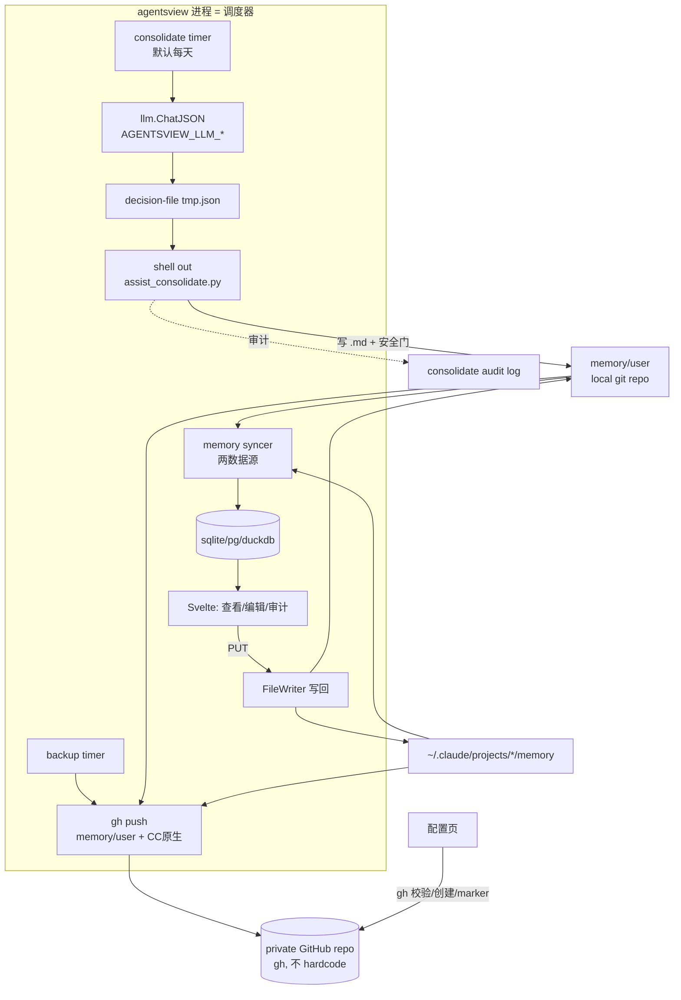

# SPEC: agentsview 驱动的 memory 闭环 + private 备份

> 子程序，扩展 `agentsview-mvviz-REQUIREMENT.md`（memory/vault 可视化已上线）。
> 上游事实见 memory `[[agentsview-memory-vault-viz-program]]` / `[[memory-vault-program]]`。
> Spike 结论已折入（SPIKE1/2/3 全部验证，见 §风险与验证）。

## TL;DR

让 agentsview 当**统一调度器**，闭合 memory 的「写→巩固→读」链路的巩固缺环，并把 memory 备份到 private GitHub repo：
1. CC 原生 memory 接入为第二数据源（可查看 + 可编辑）；
2. 后台定时**全自动巩固**（LLM 出决策 → dotfiles `assist_consolidate.py` 安全落盘 → commit 可回退）；
3. 后台定时把 `memory/user` + CC 原生**备份 push** 到 private repo；
4. 配置页用本地 `gh` 一键连接/创建 private repo（不 hardcode、不 OAuth）。

推荐：`/dev-long-run` 在隔离 worktree 分 5 phase 实现；安全逻辑 SSOT 留在 dotfiles 不动。

## 已锁定（用户决策 + spike 事实）

- **L1** consolidate = **全自动定时**（用户选）。agentsview timer（默认每天，可配）→ 调 `AGENTSVIEW_LLM_*` client 出 ADD/UPDATE/SKIP 决策 → shell out `assist_consolidate.py` 落盘。
- **L2** 巩固的安全门（反自我毒化黑名单 + 晋升判据 + fail-closed redact）**仍由 `assist_consolidate.py` 跑**，Go 侧不重写。每次晋升 commit 进 `memory/user` local repo（已是无 remote 的 local-only git repo）= 全审计 + 一命令回退。
- **L3** CC 原生 memory（`~/.claude/projects/*/memory/*.md`）接入为**第二数据源**，可查看 + 可编辑（复用 `internal/memory/writer.go` 的 `FileWriter`）。CC 原生仍由 CC 自管，巩固**不**写 CC 原生。
- **L4** 备份范围 = `memory/user` + CC 原生，都 push 到**新建 private repo**。
- **L5** 同步**绑定 agentsview**（开着才跑），**不做**系统级 cron/launchd。
- **L6** GitHub 接入用本地已认证 `gh`（账号 `ZhenningLang`，含 `repo` scope，ssh 协议），**不用 OAuth device flow**。配置页填 namespace 或 repo URL → gh 校验。
- **L7** redact-before-push = **不做**（用户决定，边界见下）。
- **L8** 三后端奇偶性硬约束：任何进 Store interface 的方法，sqlite/postgres/duckdb 三后端都要实现（`internal/backendcontract/contract.go` 编译时检查）。
- **L9** 跨 repo：dotfiles 安全 SSOT（`assist_consolidate.py` 等）**不动**；新代码全在 agentsview 隔离 worktree；**绝不在主 repo push**；memory **永不进 PUBLIC 仓库**。

### 边界决策（Boundary decisions，须用户知情）

- **operational-side-effect / observability**：开启 L7=不做 redact，等于接受「CC 原生若曾捕获 secret，会随备份进 private GitHub repo」的风险。缓解仅靠 repo 私有性，不靠内容扫描。（用户已批准）
- **operational-side-effect**：L1 全自动巩固 = 后台静默调 LLM 写 memory。缓解 = L2 的确定性安全门 + 每步可 git 回退 + UI 审计页可见每次决策。

## 已决（原待决策，用户已拍板）

- **D-a ✅ 一期拆独立巩固模型配置**：新增 `AGENTSVIEW_CONSOLIDATE_*`（base/key/model，OpenAI 兼容，缺省 fallback 到 `AGENTSVIEW_LLM_*`）。巩固决策用更强模型，质量更可控。Phase3 落地。
- **D-b ✅ 加文件锁 single-flight**：巩固 + 备份周期前抢 `memory/.staging/.consolidate.lock`（含 push 用 `.backup.lock`），第二实例本周期跳过。Phase3/5 落地。
- **D-c ✅ 默认 repo 名 = `agent-memory`**：只填 namespace 时建 `<owner>/agent-memory`（private）。Phase4 落地。

## 边界

**Goals**
- CC 原生 memory 在 agentsview 可查看 + 可编辑。
- 后台全自动巩固 staging→memory/user，可回退、可审计。
- 后台把 memory/user + CC 原生备份到 private repo。
- 配置页用 gh 一键连接/创建 private repo。

**Non-goals**
- 不改 dotfiles 的巩固安全逻辑（`assist_consolidate.py` 是 SSOT，只被调用）。
- 不做 redact-before-push（L7）。
- 不做系统级常驻服务（L5，绑定 agentsview 进程）。
- 不让巩固写 CC 原生 memory（CC 自管）。
- 不实现 OAuth/PAT 录入（用 gh）。
- 不改 capture（写）与 retrieve（读）hook —— 它们已就绪，本程序只补「巩固 + 备份 + 可视化编辑」。

**Constraints**
- 三后端奇偶性；隔离 worktree；主 repo 不 push；memory 不进 PUBLIC repo；gh 已认证为前提（未认证则 UI 显式报错，不静默）。

## 场景化推演

| Scenario | Actor / Context | Step-by-step path | System touchpoints | Exposed issue | Requirement / Contract |
|---|---|---|---|---|---|
| S1 自动巩固 happy | agentsview timer（每天） | 读 `memory/.staging/raw_memories/*.json` → 拼 prompt 调 `llm.ChatJSON` → 解析出 `{cand_id:{action}}` → 写 tmp decision-file → `python3 assist_consolidate.py --root <dotfiles> --raw-dir … --decision-file tmp` → 脚本过安全门写 `memory/user/x.md` → agentsview `git -C memory/user commit` → memory syncer 刷新 DB → UI 页面出现新 memory | LLM client、staging 目录、python 子进程、memory local repo、memory DB、Svelte | LLM 输出可能非 JSON / 含被黑名单拦的候选 | C1: LLM 输出解析失败 → **跳过本周期 + 记审计日志**，不写垃圾；C2: 候选被安全门 SKIP → 记 `skip:reason`，不固化 |
| S2 自动巩固反毒化 | 同上，候选是「工具坏了」类叙事 | 同 S1 直到 python 脚本 | python 脚本反自我毒化黑名单 | 自我毒化候选若被写入会硬化成 agent 月余自我拒绝 | C3: `assist_consolidate.py` 黑名单命中 → 不写；agentsview 审计页显示该候选 `rejected:negative_tool_claim` |
| S3 gh 连错项目 | 用户在配置页填了个已有别的项目的 repo | 输入 repo URL → agentsview `gh repo view <r> --json visibility` → 存在+private → 查 repo 根有无 `.memory-backup-marker` → **无 marker 且有陌生文件** | gh 子进程、远端 repo 内容探测 | 误把无关项目设成 memory 备份目标 → 污染/覆盖风险 | C4: 无 marker + 非空 → **拒绝并告警**「该 repo 已有内容且非本工具管理，确认请先手动清空或换 repo」；不自动写 |
| S4 CC 原生编辑写回 | 用户在 UI 改 CC 原生某 memory | UI PUT `{base_sha, content}` → agentsview 定位该文件属于哪个 `~/.claude/projects/<hash>/memory` → `FileWriter` 校验 base_sha（过期→409）→ 路径逃逸守卫（→400）→ atomic write | 多 project memory 目录、writer | 单 `FileWriter(dir)` 模型假设单一 root，CC 原生跨多 project 目录 | C5: writer 扩成「按文件解析所属 project memory root」；CC 原生无 git → 历史先不做或对其父目录单独处理（标注） |
| S5 gh 未登录 | timer 到点要 push，但 gh token 失效 | push 周期前 `gh auth status` 失败 | gh 子进程 | 静默 push 失败，用户以为备份了其实没有 | C6: push 失败 → **fail-soft + UI 状态栏显式标红**「备份失败：gh 未认证」，不崩 |

## 方案

### 架构



安全逻辑（黑名单/晋升/redact）100% 在 `assist_consolidate.py`（dotfiles，不动）；agentsview 只做「调 LLM 出决策 + 调脚本 + 调度 + UI」。

### 备选与取舍

- **Go 内重写巩固逻辑**（弃）：会让反毒化/redact 安全门出现双 SSOT 漂移，违背 L2/L9。
- **系统级 cron 巩固/push**（弃）：用户明确要绑 agentsview（L5）。
- **OAuth device flow**（弃）：gh 已认证，多余依赖（L6）。

### Premise Collapse

- `If LLM 输出稳定可解析为 decision JSON，<直接喂 assist_consolidate.py>。If not，写入垃圾决策或脚本报错` → 缓解 C1：agentsview 防御性解析 + schema 校验 + 失败跳过本周期记审计；`assist_consolidate.py` 本身对缺 `action` 抛 `ConsolidationError`（已验证，§风险）。
- `If 同一时刻只有一个 agentsview 实例带 timer，<无锁巩固/push>。If not（CLI serve + 桌面 app 并存），并发写 memory/staging 竞态` → D-b 待决（推荐文件锁）。
- `If CC 原生 memory 在单一目录，<复用 FileWriter(dir)>。If not（跨多 project 目录），单 root 写回定位不到文件` → C5：writer 扩多 root（已知改造点，已验证 writer 接口）。

## 风险与验证

**Spike 结论（已验证为事实）**
- SPIKE1 ✅ `internal/llm/client.go` `Client.ChatJSON(ctx, system, user)(string,error)`，OpenAI 兼容、靠 `config.LLMConfig` 配置、可后台调、模型可配。
- SPIKE2 ✅ `assist_consolidate.py` CLI = `--root --raw-dir --decision-file`；decision = `{"action":...}`（全体）或 `{cand_id:{"action":...}}`；缺 `action` 抛 `ConsolidationError`；动作 ADD/UPDATE/SKIP/DELETE/INVALIDATE，UPDATE/DELETE/INVALIDATE 带 `note_id`。
- SPIKE3 ✅ scheduler 模式现成（`main.go` `startSkillSync`/`startMemorySync` + `pg_watch_loop.go` `pushLoop`）；`internal/memory/writer.go` `FileWriter`（Read/Write/commit/resolvePath 逃逸守卫/rebuildIndex/HistoryEntry）可复用，改造点=多 root。

**inner-loop verifier**：各 phase 的 Go 单测（syncer/writer/decision-parse/marker-validate）+ `make test`（三后端）+ `make build`。

**acceptance verifier**（端到端真数据，非单测）：
- A1 巩固：手动放一个真 staging 候选 → 触发 timer（或测试入口）→ 观察 `memory/user` 出现新 .md + local repo 多一个 commit + UI 出现该 memory + 审计页显示决策；放一个「工具坏了」候选 → 观察被 reject 不写。
- A2 CC 原生编辑：UI 改一个 CC 原生 memory → 文件真变 + base_sha 冲突回 409。
- A3 gh 备份：配置页填 namespace → 自动建 private repo + 推上 memory/user + CC 原生 → `gh repo view` 确认 private + 内容到位 + marker 存在；填已有陌生 repo → 被拒。
- A4 fail-soft：临时 `gh auth logout` → push 周期 UI 标红不崩。

**回退**：隔离 worktree + 分支，丢弃即无残留；备份 repo 可删；memory local repo 每步 commit 可 `git revert`。

## 实施步骤（phase 概览，细节进 dev-long-run scaffold）

1. **Phase 1 — CC 原生数据源（只读）**：syncer 扫 `~/.claude/projects/*/memory/*.md` → 新 store 表（三后端）→ Huma route → Svelte 第二 memory tab。
2. **Phase 2 — CC 原生编辑写回**：`FileWriter` 扩多 root（按文件定位 project memory 目录）→ PUT API → UI 编辑。CC 原生无 git，历史降级标注。
3. **Phase 3 — 自动巩固调度**：`startMemoryConsolidate`（timer，可配间隔）→ 读 staging → `llm.ChatJSON` 出决策（防御性解析）→ tmp decision-file → shell out `assist_consolidate.py` → `git -C memory/user commit` → 审计日志 + UI 审计页。D-b 锁。
4. **Phase 4 — gh-connect 配置**：配置页输入 namespace/URL → gh 校验（auth/exists/private/marker）→ 不存在 `gh repo create --private` + 写 marker → set remote。C4 拒陌生 repo。
5. **Phase 5 — 自动备份 push**：`startMemoryBackupPush`（timer，绑 agentsview）→ 收集 memory/user + CC 原生 → commit + `git push`（gh 凭证）→ fail-soft + UI 状态。

---

```yaml
# spec-contract
checks:
  - "Phase1: agentsview 启动后 CC 原生 memory 出现在第二数据源页面，条数=~/.claude/projects/*/memory/*.md 实际文件数"
  - "Phase2: UI 编辑 CC 原生 memory 后磁盘文件内容改变；过期 base_sha 返回 409；../escape 路径返回 400"
  - "Phase3: 放入真 staging 候选并触发巩固，memory/user 新增对应 .md 且 local repo 新增 commit；放入 negative_tool_claim 候选则不写且审计页标 rejected"
  - "Phase3: LLM 返回非 JSON 时巩固跳过本周期且记审计，不写入垃圾、不崩溃"
  - "Phase4: 填 namespace 自动建 private repo 并写 .memory-backup-marker；填已有陌生 repo（无 marker 且非空）被拒绝告警；填 PUBLIC repo 被拒绝"
  - "Phase5: 备份周期把 memory/user + CC 原生 push 到 private repo，gh repo view 确认私有且内容到位；gh 未认证时 UI 标红不崩"
  - "三后端: make test 通过（sqlite/pg/duckdb），新 Store 方法三后端都实现"
non_goals:
  - "不改 dotfiles assist_consolidate.py 安全逻辑（只调用）"
  - "不做 redact-before-push"
  - "不做系统级 cron/launchd（绑 agentsview 进程）"
  - "巩固不写 CC 原生 memory"
  - "不实现 OAuth/PAT（用 gh）"
  - "不改 capture/retrieve hook"
validation_commands:
  - "make test"
  - "make build"
locked_decisions:
  - "巩固模型: 独立 AGENTSVIEW_CONSOLIDATE_*(fallback AGENTSVIEW_LLM_*)"
  - "并发: 文件锁 single-flight(.consolidate.lock / .backup.lock)"
  - "默认 repo 名: <owner>/agent-memory (private)"
  - "consolidate 全自动定时（agentsview timer，默认每天可配）"
  - "安全门由 assist_consolidate.py 跑，Go 不重写；每次晋升 commit memory/user local repo"
  - "CC 原生接入为第二数据源，可查看可编辑，巩固不写 CC 原生"
  - "备份 memory/user + CC 原生到 private repo，同步绑 agentsview"
  - "gh 连接/创建 private repo，不用 OAuth；不 hardcode repo"
  - "redact-before-push 不做（边界已记）"
  - "memory 永不进 PUBLIC repo；主 repo 不 push；隔离 worktree"
derisk_spikes:
  - type: "第三方 CLI 契约（gh / python assist_consolidate.py）"
    question: "decision-file 格式 + gh 校验/创建命令契约"
    method: "读 assist_consolidate.py argparse/decision 解析 + gh auth/repo 实测"
    status: "verified"
  - type: "内部 API 行为（agentsview LLM client）"
    question: "ChatJSON 能否后台调 + 模型可配"
    method: "读 internal/llm/client.go 接口"
    status: "verified"
  - type: "数据形态边界（CC 原生跨多 project 目录）"
    question: "单 FileWriter(dir) 能否覆盖多 root"
    method: "读 writer.go resolvePath 模型"
    status: "verified（改造点=多 root，已纳入 Phase2）"
```
