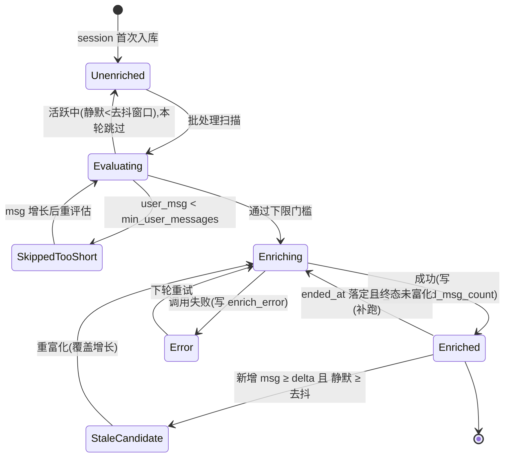
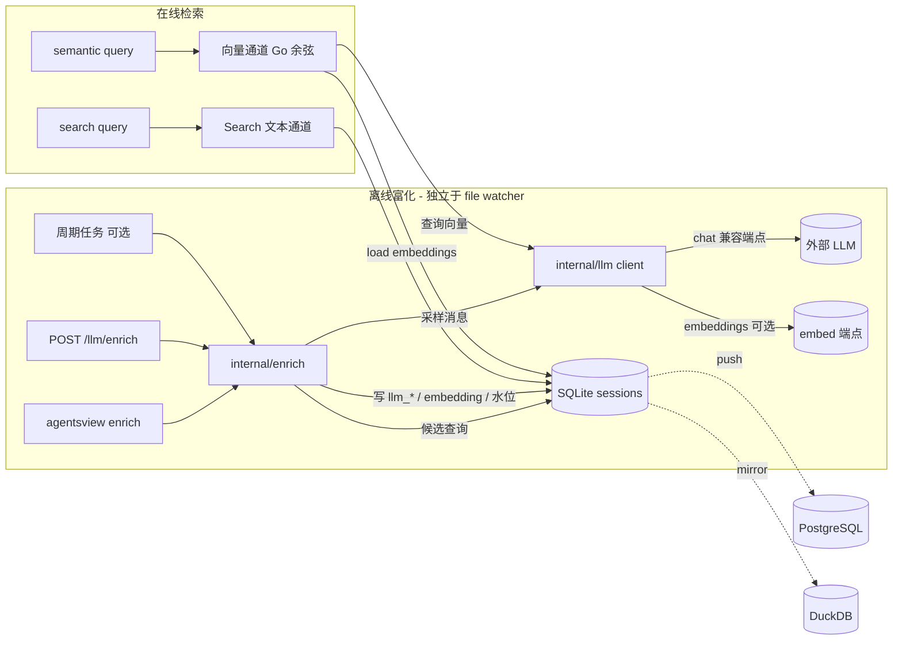

# Spec: LLM 会话富化与语义检索

> 读者：本仓库的实现 agent / reviewer。产物：可实现的 SSOT spec。
> 状态：待用户批准（spec mode，未写实现代码）。

## TL;DR

新增**可配置的 LLM 富化能力**（OpenAI 兼容端点 + apikey + 默认 reasoning 等级），
离线为每个 session 生成 `llm_title / llm_summary / llm_keywords`，可选生成
embedding。富化结果接入检索：文本通道（关键词/标题纳入 LIKE 名称分支）+ 向量通道
（embedding 暴力余弦，三后端 Go 内统一计算）。界面提供标题显示开关、语义搜索入口、
LLM 余额展示、富化触发按钮。**默认 OFF**，未配置 `[llm]` 时全部走旧行为、零外发、零成本。

推荐分三阶段交付：P1 文本富化闭环（client+enricher+schema+文本检索+config）→
P2 前端（标题开关+触发+余额）→ P3 向量语义检索。每阶段独立可验收。

## 已锁定（来自 scope 对齐）

1. **标题 = 可切换显示选项**：新增 `llm_title`，前端开关切换"原标题 ⇄ LLM 标题"，
   状态持久化；未富化 session 回退原标题。不改 `display_name` 优先级底层语义。
2. **触发 = 增量富化**，四级门控：**下限门槛(规模) → 增量水位(覆盖) → 去抖(成本) → 终态补跑(完整)**。
   一个 session 生命周期内可被多次富化，但有上界、成本可控。
3. **检索 = 文本 + 向量双通道**。向量用 embedding + 暴力余弦，零新依赖，三后端 parity。
4. **余额展示**：配了 apikey 才显示；provider-aware；查不到静默隐藏，不报错占位。
5. **默认 OFF**：master switch `[llm].enabled=false`；未配置则旧行为零回归。
6. **三后端 parity**：SQLite 主、PG/DuckDB 对齐（AGENTS.md 强约束）。新增能力进
   `db.Store` 接口（`internal/db/store.go:18`），由 `backendcontract` 编译期断言强制。
7. **不动事实域**：不碰 `messages`/`tool_calls`/stats 触发器/`NormalizeToolCategory`；
   富化是独立于 file watcher 热路径的离线步骤（参考 SkillSyncer 范式）。
8. **采样/噪声过滤复用 mantis 策略**：首 3 + 尾 3 + 中间采样，单条截断 500 字符，
   过滤 `len<5`/"已取消"/`<system-reminder>` 等噪声。

## 待决策（需用户拍板，阻塞相关部分）

### D1【阻塞 P3】embedding 由谁提供？

`[未验证]` 你将用的 chat provider（Kimi/moonshot?）是否提供 `/v1/embeddings`。
OpenAI 兼容 ≠ 一定有 embeddings 端点。

- **推荐**：embedding 配置与 chat **解耦**——`[llm.embed]` 独立 `base_url/api_key/model`
  （留空则复用 chat 的）。若任一 provider 不提供 embeddings，可单独指向 OpenAI / 本地
  （如 ollama `nomic-embed-text`）。`embed_model` 为空 → 语义搜索自动禁用，P1/P2 不受影响。
- 取舍：解耦更稳健（不被单一 provider 能力绑死），代价是多几个配置项。

→ 默认按"解耦 + 语义搜索可独立开关"设计，P3 实现前用 **spike-1** 验证实际端点。

### D2【已验证】reasoning 等级如何传递？

`[已验证 2026-06-23]` 选定 provider = **DeepSeek**。spike 实测 `deepseek-chat` 接受
`reasoning_effort` 字段并返回 http=200（容忍/忽略，不报错）。

- config 存 `reasoning_effort`（low/medium/high）作为 pass-through 注入请求；保留容错
  （4xx → 去字段重试一次）以兼容其他 provider。DeepSeek 下无需降级。

### D3【可自由裁量，给出推荐】文本检索如何接入？

- **推荐（v1）**：扩展现有 `Search()` 的 **name 分支 LIKE**，把 `llm_title/llm_keywords/
  llm_summary` 纳入匹配（`internal/db/search.go:216-246`）。LIKE 子串对中文友好（绕开
  FTS `unicode61` 不分词问题），三后端实现一致、parity 成本最低。
- 备选：建独立 `sessions_fts`（带排序）。给英文更好排序，但 CJK 收益有限、加 parity 复杂度。
  → 暂不做，标为后续可选增强。

## 边界

### Goals

- G1 配置 OpenAI 兼容端点后，能用"主题词/近义词"搜到正文未字面命中的 session。
- G2 标题可在原始 ⇄ LLM 间切换显示，未富化优雅回退。
- G3 长 session 追加足够新消息后会被重富化；活跃 session 不会每条消息触发；成本有上界。
- G4 配了 apikey 且 provider 支持时展示余额；否则静默隐藏。
- G5 三后端检索行为 parity；未配置 LLM 时旧行为零回归。

### Non-goals

- N1 不做富化结果的人工编辑/审校 UI（仅展示 + 重新触发）。
- N2 不引入 sqlite-vec / pgvector / 外部向量库（用 Go 暴力余弦保 parity）。
- N3 不把富化塞进同步热路径或 SSE 实时链路。
- N4 不改 `display_name`/`session_name`/`first_message` 的解析与底层优先级。
- N5 不做多语言 prompt 适配工程（prompt 支持中英混合即可，复用 mantis 思路）。
- N6 不做向量检索与文本检索的分数融合排序（v1 语义搜索是独立模式，不混排）。

### Constraints

- C1 `CGO_ENABLED=1` + `-tags "fts5,kit_posthog_disabled"`；新增能力进 `db.Store`。
- C2 stdlib 优先（AGENTS.md）；LLM client 用 `net/http`，不引 SDK。
- C3 SQLite 是持久归档，schema 改动走非破坏性迁移（`ALTER TABLE ADD COLUMN`），
     不重建库。PG `alters` slice + coreDDL；DuckDB columns list + `SchemaVersion` bump。
- C4 富化默认 OFF；秘密（apikey）不进日志、不进 PG push、不进任何导出。
- C5 富化把 session 正文（采样后）发往外部端点——隐私边界，需文档明示 + 显式开关。

## R / S Fit 矩阵

需求（R）× 机制（S）。✅ 覆盖 / ❌ 不覆盖。

| | S1 llm client | S2 enricher+调度 | S3 schema+parity | S4 文本检索 | S5 向量检索 | S6 config | S7 前端 | S8 余额端点 |
|---|---|---|---|---|---|---|---|---|
| R1 近义词/主题搜得到 | ✅ | ✅ | ✅ | ✅ | ✅ | ✅ | ❌ | ❌ |
| R2 标题可切换 | ✅ | ✅ | ✅ | ❌ | ❌ | ❌ | ✅ | ❌ |
| R3 覆盖增长且控成本 | ❌ | ✅ | ✅ | ❌ | ❌ | ✅ | ✅ | ❌ |
| R4 余额展示 | ✅ | ❌ | ❌ | ❌ | ❌ | ✅ | ✅ | ✅ |
| R5 未配置零回归 | ✅ | ✅ | ✅ | ✅ | ✅ | ✅ | ✅ | ✅ |
| R6 三后端 parity | ❌ | ❌ | ✅ | ✅ | ✅ | ❌ | ❌ | ❌ |

每行至少一个 ✅（无遗漏需求）；每列至少一个 ✅（无多余机制）。
R1 的 S5 标 ✅ 但依赖 D1 spike——见 derisk。

## 场景化推演

| Scenario | Actor / Context | Step-by-step path | System touchpoints | Exposed issue | Requirement / Contract |
|---|---|---|---|---|---|
| S-A 近义词召回 | 用户搜"鉴权"，但目标 session 全程用"登录/token" | 输入 query → 文本通道 LIKE 命中 keywords("鉴权,登录,token") → 命中 session | `Search()` name 分支 + `llm_keywords` 列 | 原 FTS 对中文不分词且无同义维度，搜不到 | R1；contract：keywords 含 query 子串则命中 |
| S-B 长任务追加 | 一个 session 上午富化(20 msg)，下午继续到 120 msg | 增量调度：msg delta=100≥阈值 且 静默≥30min → 重富化 → 更新 `enriched_msg_count=120` | enricher 候选查询 + 水位列 | 一次性富化覆盖不到后续；每消息富化太贵 | R3；contract：delta≥阈值且静默→重跑；活跃中不跑 |
| S-C 短会话跳过 | 2 条消息的废弃 session | enricher 候选评估：`user_message_count < min` → 标 `enrich_status='skipped_too_short'`，不调 LLM | 下限门槛 + status 列 | 短 session 浪费 API、产烂标题 | R3；contract：<门槛不调用、不重复评估 |
| S-D provider 无 embeddings | 用户只配了 chat(kimi)，没配 embed | enricher 文本富化正常；embedding 步骤检测 `embed_model==""` → 跳过；语义搜索入口隐藏 | `[llm.embed]` 配置 + 前端 gating | 假设 chat provider 有 embeddings 会崩 | D1；contract：embed 未配→P1/P2 完整可用 |
| S-E 余额不支持 | 用户配了某非 moonshot OpenAI 兼容端点 | 前端请求 `/llm/balance` → 后端 provider 不匹配且无 `balance_url` → 返回"unsupported" → 前端不渲染余额区 | provider 适配 + AppHeader gating | 余额非标准接口，硬查会 404/报错 | R4；contract：不支持→静默隐藏，无错误占位 |
| S-F 富化中断/失败 | 批跑到第 800 个时网络错误 | 单 session 失败 → 标 `enrich_status='error'`+`enrich_error`，不阻塞其他；下次批跑重试 error 状态 | enricher worker 错误处理 | 单点失败不应中断整批；不应反复无脑重试 | R3；contract：失败隔离 + 可重试 + 不污染水位 |
| S-G 未配置 LLM | 全新用户，没配 `[llm]` | 所有 LLM 路径短路；search 走旧逻辑；前端无标题开关/无余额/无语义入口 | `enabled` gate 全链路 | 默认行为必须零变化 | R5；contract：未配置=旧行为逐字节等价 |

失败/边界路径已覆盖（S-D/E/F/G）。

## 架构

### 富化生命周期（状态机）



### 数据流



## 方案细节

### S1 — LLM client (`internal/llm/`)

- `client.go`：`net/http` OpenAI 兼容 client。
  - `ChatJSON(ctx, messages, opts) (string, error)`：POST `{base_url}/chat/completions`，
    `response_format={type:"json_object"}`（若 provider 支持）；注入 `reasoning_effort`
    （D2 pass-through + 容错）；超时、有限重试 + 指数退避。
  - `Embed(ctx, input) ([]float32, error)`：POST `{embed_base_url}/embeddings`；返回向量。
  - 错误分类：4xx(配置/契约错，不重试) vs 5xx/网络(重试)。
- `extract.go`：从 chat 响应稳健解析 JSON `{title, summary, keywords:[]}`（容忍代码块包裹、前后噪声）。
- apikey 仅在内存与请求头，绝不写日志（C4）。

### S2 — Enricher (`internal/enrich/`)

参考 `internal/skills` SkillSyncer 范式（独立调度，非 file watcher）。

- 候选查询（四级门控，SQL）：
  ```
  WHERE enabled 且 (
    enrich_status='' OR enrich_status='error'         -- 从未/失败
    OR (enriched_msg_count>0 AND message_count - enriched_msg_count >= reenrich_msg_delta)  -- 增量
  )
  AND user_message_count >= min_user_messages          -- 下限门槛
  AND (ended_at IS NOT NULL OR <最后活动距今 >= reenrich_idle_minutes>)  -- 去抖/终态
  ```
  低于门槛者一次性标 `skipped_too_short`，避免每轮重复评估（msg 增长后由增量条件重新纳入）。
- worker pool（默认并发 3，可配，避免 rate limit）；单 session 失败隔离（S-F）。
- 采样 `sampleMessages(session)`：复用 mantis `extractUserMessages` 思路
  （首3+尾3+中间采样≤4，单条截 500，`isNoise` 过滤）。
- 写回：单 session 一次 UPDATE 写 `llm_title/llm_summary/llm_keywords/embedding/
  enriched_at/enriched_msg_count/enrich_model/enrich_status/enrich_error`。
- 入口：
  - CLI `agentsview enrich [--all] [--project P] [--force] [--limit N]`（`cmd/agentsview/`）。
  - HTTP `POST /llm/enrich`（local-only，返回进度/计数；PG 模式 `ErrReadOnly`）。
  - 可选周期：复用现有 15min sync tick，门控同上（默认关，`[llm].periodic=false`）。

### S3 — Schema + parity

`sessions` 表新增列（全部 `NOT NULL DEFAULT ''/0`，可空向量除外）：

| 列 | 类型 | 含义 |
|---|---|---|
| `llm_title` | TEXT '' | LLM 改写标题 |
| `llm_summary` | TEXT '' | 一句话摘要 |
| `llm_keywords` | TEXT '' | 关键词扁平文本（逗号连接，供 LIKE） |
| `llm_embedding` | BLOB NULL | float32 向量（小端字节）；NULL=未生成 |
| `llm_embedding_dim` | INTEGER 0 | 向量维度 |
| `enriched_at` | TEXT '' | 末次富化时间 RFC3339 |
| `enriched_msg_count` | INTEGER 0 | 富化时的 message_count（增量基准） |
| `enrich_model` | TEXT '' | 富化所用 model |
| `enrich_status` | TEXT '' | ''/ok/skipped_too_short/error/no_content |
| `enrich_error` | TEXT '' | 末次错误摘要 |

落地点（三处 parity）：
- SQLite：`internal/db/schema.sql` 建表加列 + `internal/db/db.go` `migrateColumns`
  追加各列 `ALTER TABLE sessions ADD COLUMN ...`（幂等）。**不 bump dataVersion**
  （`init()` 每次 Open 跑 `schemaSQL`；与 skills 同决策）。
- PG：`internal/postgres/schema.go` coreDDL + `alters` slice 追加；`CheckSchemaCompat`
  探针加新列（BYTEA 存向量）。
- DuckDB：`internal/duckdb/schema.go` mirror columns 追加 + **bump `SchemaVersion`**
  （现 3 → 4）；BLOB 存向量。
- 更新对应 schema_test.go 的 ALTER 计数 / version 断言。

### S4 — 文本检索通道

- `internal/db/search.go` `Search()`：name 分支的 LIKE 条件与 CASE snippet 扩展，
  纳入 `s.llm_title / s.llm_keywords / s.llm_summary`（D3 推荐）。
- PG `internal/postgres/messages.go`、DuckDB 对应 search 同步扩展（ILIKE/LIKE），保持
  查询形状 parity（AGENTS.md）。
- 旧行为兼容：列默认 ''，未富化 session 的新 LIKE 项恒不命中，等价旧逻辑（R5）。

### S5 — 向量语义检索通道（P3）

- `db.Store` 新增 `SessionEmbeddings(ctx, f) ([]SessionEmbedding, error)`（id+vector+meta）。
  三后端各自实现（仅"读出向量行"，相似度算在共享 Go 代码）。
- `internal/search`（或 server 层）：`SemanticSearch(ctx, query, k)`：
  1. `llm.Embed(query)` 得查询向量；
  2. `Store.SessionEmbeddings` load（带进程内缓存 + 失效）；
  3. Go 内余弦相似度 top-K（阈值过滤）。
- 规模评估：~5000 session × 1536 dim × 4B ≈ 30MB；暴力余弦 ms 级，单用户本地足够（N2）。
- HTTP `GET /search/semantic?q=&k=`；前端独立"语义搜索"模式（N6 不混排）。
- 未配 embed → 该端点返回明确"disabled"，前端隐藏入口（S-D）。

### S6 — Config

```toml
[llm]
enabled = false                          # master switch（默认 OFF）
base_url = "https://api.deepseek.com"    # 选定 DeepSeek；chat 在 /chat/completions
api_key = ""                             # 也可经 AGENTSVIEW_LLM_API_KEY 注入
model = "deepseek-chat"                  # chat model（title/keywords）
reasoning_effort = "medium"              # low/medium/high，pass-through+容错
min_user_messages = 3                    # 下限门槛
reenrich_msg_delta = 20                  # 增量阈值
reenrich_idle_minutes = 30               # 去抖窗口
concurrency = 3
periodic = false                         # 周期富化（默认关）
balance_url = ""                         # 余额端点覆盖（未知 provider 手配）

[llm.embed]                              # 解耦；留空则复用 chat 的 base_url/api_key
base_url = ""
api_key = ""
model = ""                               # 为空 → 语义搜索禁用
```

- `internal/config/config.go`：加 `LLMConfig`/`LLMEmbedConfig` 结构体；`loadFile` anon struct
  加 `LLM` 字段 + env-wins 合并（仿 `PGConfig` 模式 `config.go:510-526`）。
- env：`AGENTSVIEW_LLM_API_KEY/BASE_URL/MODEL/ENABLED/...`（仿 `loadEnv` `config.go:702-734`）。
- apikey 不进任何序列化导出（C4）。

### S7 — 前端

- `frontend/src/lib/api/llm.ts`：`fetchBalance()`、`triggerEnrich()`、`semanticSearch()`、
  富化状态查询。
- **标题开关**：全局设置（store + localStorage），列表/详情标题取值时若开启且 `llm_title`
  非空则用之，否则回退原标题。涉及 session 列表组件与 `api/sessions` 类型加 `llm_title`。
- **余额**：`AppHeader.svelte` 右上工具栏图标区（`SearchIcon` 附近，约 `:372`）加余额 chip；
  `enabled && balance!=null` 才渲染。
- **语义搜索**：搜索框旁 mode 切换（关键词 / 语义）；语义模式调 `/search/semantic`。
  embed 未配置 → 不显示该 mode。
- **富化触发/状态**：在 Skills 页风格的位置加"富化"入口（按钮 + 进度 + 各 status 计数）。
- 视觉：复用现有 theme-token，无渐变/glass/emoji；改动后截真实截图（桌面+移动）核对 overflow/状态。

### S8 — 余额端点

- `GET /llm/balance`（local-only）：provider-aware。
  - base_url 含 `deepseek` → `GET {scheme}://{host}/user/balance`（**根域，非 /v1**）；
    `[已验证 2026-06-23]` 返回 `{is_available, balance_infos:[{currency, total_balance,
    granted_balance, topped_up_balance}]}`；取 `balance_infos[0]`（currency + total_balance）。
  - base_url 含 `moonshot` → `GET {base_url}/users/me/balance`（`[未验证]`，按需适配）。
  - 否则若配 `balance_url` → 用之。
  - 否则 → 返回 `{supported:false}`。
- 失败/不支持 → `{supported:false}` + 后台 log，前端静默隐藏（R4/S-E）。

## Premise Collapse + Derisk Spikes

脆弱点扫描（对照 fragility-types.md）：命中 **类型2(第三方API契约)**、**类型3(鉴权/token)**、
**类型1(SaaS配额/rate limit)**、**类型4(数据形态)**。

Premise collapse 声明：

- **P1 文本富化**：`If chat 端点接受标准 OpenAI /chat/completions 且能返回可解析 JSON，
  <文本富化方案成立>。If does not hold, 富化产物无法解析 → 全部 session 标 error，功能空转。`
  → 缓解：`extract.go` 稳健解析 + spike-2 先打真实端点确认。
- **P3 向量检索**：`If embed provider 提供 /v1/embeddings 且维度稳定，<语义检索成立>。
  If does not hold, 向量列恒空，语义搜索不可用（但 P1/P2 不受影响，优雅降级）。`
  → 缓解：D1 解耦 + embed 未配自动禁用 + spike-1。
- **余额**：`If provider 提供可识别的余额端点，<余额展示成立>。If does not hold, 静默隐藏。`
  → 影响面已被 N1/S-E 限制到"隐藏"，非阻塞。
- **批量 rate limit**：`If 并发≤3 + 退避能避开 provider rate limit，<一次性批跑 4820 session 可行>。
  If does not hold, 大量 429 → 批跑变慢/部分 error。`
  → 缓解：低并发默认 + 退避 + error 状态可续跑（S-F）。

Spikes（实现前必须把假设变事实；需用户提供 endpoint/apikey 后由用户或在其授权下执行）：

Provider 选定：**DeepSeek**（base_url `https://api.deepseek.com`，model `deepseek-chat`）。

| spike | 类型 | 唯一问题 | 结果 | status |
|---|---|---|---|---|
| spike-1 | 2 | DeepSeek embed 端点是否存在 | ❌ `/embeddings` http=404，DeepSeek 无 embeddings | **verified**：P3 需另配 embed（ollama/openai），deepseek-only 时语义搜索禁用 |
| spike-2 | 2 | chat 是否接受 reasoning_effort + 返回可解析 JSON | ✅ `response_format:json_object` 返回干净 `{title,keywords}`；`reasoning_effort` 容忍 http=200 | **verified**（P1 可建） |
| spike-3 | 2 | DeepSeek 余额端点路径/结构 | ✅ `GET /user/balance`（根域）→ `{is_available,balance_infos:[{currency:"CNY",total_balance}]}` | **verified**（P2 余额可建，deepseek 适配） |
| spike-4 | 1 | 批量并发下 rate limit 行为 | 未压测 | deferred（低并发默认 + 退避兜底） |

## 风险与验证

- **最大风险**：D1（embed 可用性）未验证就实现 P3 → 返工。缓解：P3 前置 spike-1，且解耦设计使
  P1/P2 不依赖它。
- **parity 风险**：新列/新检索在三后端不一致。验证：`backendcontract` 编译断言 + 三后端
  search 测试对齐。
- **隐私/成本**：默认 OFF + 显式开关 + 文档明示 + apikey 不外泄（C4）。

验证（inner-loop vs acceptance）：

- inner-loop：`make test`（含新 enricher/调度/解析/余弦单测，table-driven + testify）；
  `make vet`；`go fmt`；PG 集成 `make test-postgres`；DuckDB 测试。
- acceptance：
  - A1(R1) 造 session：keywords 含"鉴权"，正文只有"登录/token"，搜"鉴权"能命中（端到端）。
  - A2(R2) 富化后前端切换标题开关，显示在原标题/LLM标题间变化；未富化回退。
  - A3(R3) 模拟 session 增长跨过 delta+静默 → 重富化；活跃中不富化；短 session 跳过。
  - A4(R4) 配/不配/不支持三态下余额展示行为正确。
  - A5(R5) 不配 `[llm]`：search 结果与改动前逐字节一致（回归）。
  - A6(R6) 同一 query 在 SQLite/PG/DuckDB 返回一致结果集。

## 回退点

- 每阶段独立 commit；列均带默认值，回退只需停用 `[llm].enabled` → 全链路短路回旧行为。
- schema 列为非破坏性 ADD COLUMN，无需删列即可弃用功能（C3）。

## 实施步骤（分阶段，每阶段可独立验收 + commit）

**P1 文本富化闭环**
1. `internal/config/` — 加 `LLMConfig`/`LLMEmbedConfig` + loadFile/env 合并 — 单测覆盖 env-wins。
2. `internal/db/schema.sql` + `db.go migrateColumns` — 加 10 列 — schema 迁移测试。
3. `internal/postgres/schema.go` + `internal/duckdb/schema.go` — parity 列 + version/alter 断言更新。
4. `internal/llm/` — client(ChatJSON) + extract — 单测（mock http，JSON 解析容错）。
5. `internal/enrich/` — 候选查询 + 调度门控 + 采样 + 写回 — table-driven 单测（四级门控）。
6. `cmd/agentsview/` — `enrich` CLI 子命令。
7. `internal/db/search.go`(+PG/DuckDB) — name 分支纳入 llm_* — 三后端 search 测试。
8. acceptance A1/A5/A6。

**P2 前端 + 触发 + 余额**
9. `internal/server/` — `POST /llm/enrich`、`GET /llm/balance`（huma 路由，仿 skills 注册）。
10. `frontend/` — `api/llm.ts`、标题开关、余额 chip、富化入口/进度。
11. acceptance A2/A3/A4 + 真实截图核对。

**P3 向量语义检索**（spike-1 通过后）
12. `db.Store` 加 `SessionEmbeddings` + 三后端实现 — backendcontract 断言。
13. enricher 增 embed 步骤（`embed_model` 非空时）。
14. `internal/search` 余弦 + `GET /search/semantic` + 前端语义模式。
15. acceptance：语义召回端到端；未配 embed 优雅禁用。

## 自审

- [x] 读者/产物/最小验收已明确（分阶段 acceptance）
- [x] 已锁定/待决策/可裁量分区
- [x] 7 个场景压测（含 4 条失败/边界路径）
- [x] 无占位符；每步带文件路径 + 验证方式
- [x] 排除项显式（N1-N6）
- [x] 方向依赖无环（P1→P2→P3 单向，P3 依赖 spike-1）
- [x] 垂直切片（按功能阶段而非技术层）
- [x] Mermaid 状态机 + 数据流
- [x] 脆弱点扫描命中类型 1/2/3/4，已挂 spike-1..4
- [x] spec-contract YAML（下附）

```yaml
# spec-contract
checks:
  - "A1: keywords 含查询词、正文不含时，文本搜索能命中该 session"
  - "A2: 标题开关在原标题/LLM标题间切换；llm_title 为空时回退原标题"
  - "A3: msg 增量≥reenrich_msg_delta 且静默≥reenrich_idle_minutes 触发重富化；活跃中不富化；user_message_count<min_user_messages 跳过"
  - "A4: 未配 apikey 不渲染余额；配且支持显示；不支持静默隐藏无报错占位"
  - "A5: 未配置 [llm] 时 search 结果与改动前一致（回归）"
  - "A6: 同一 query 在 SQLite/PG/DuckDB 返回一致结果集"
non_goals:
  - "不做富化结果人工编辑 UI"
  - "不引入 sqlite-vec/pgvector/外部向量库"
  - "不把富化塞进同步热路径或 SSE"
  - "不改 display_name/session_name/first_message 底层优先级"
  - "不做向量与文本检索的分数融合排序"
validation_commands:
  - "make test"
  - "make vet"
  - "go fmt ./..."
  - "make test-postgres"
locked_decisions:
  - "标题=可切换显示选项，不改优先级底层语义"
  - "触发=四级门控增量富化（下限/增量/去抖/终态）"
  - "向量=embedding+Go暴力余弦，零新依赖，三后端parity"
  - "默认OFF，未配置零回归"
  - "新增能力进 db.Store，backendcontract 编译期强制 parity"
  - "采样/噪声过滤复用 mantis 策略"
derisk_spikes:
  - type: "2 (第三方API契约)"
    question: "embed 端点是否存在、维度多少"
    method: "真实 apikey curl /v1/embeddings"
    status: "spike-before-implement (P3)"
  - type: "2 (第三方API契约)"
    question: "chat 是否接受 reasoning_effort 且能返回可解析 JSON"
    method: "curl /chat/completions 实测"
    status: "spike-before-implement (P1)"
  - type: "2 (第三方API契约)"
    question: "moonshot 余额端点路径/返回结构"
    method: "curl /users/me/balance"
    status: "spike-before-implement (P2 余额)"
  - type: "1 (SaaS配额/rate limit)"
    question: "批量并发下 rate limit 行为"
    method: "小批 20 实跑观察 429"
    status: "deferred (低并发+退避兜底)"
```
